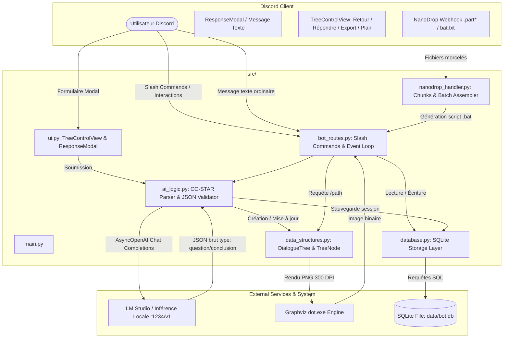
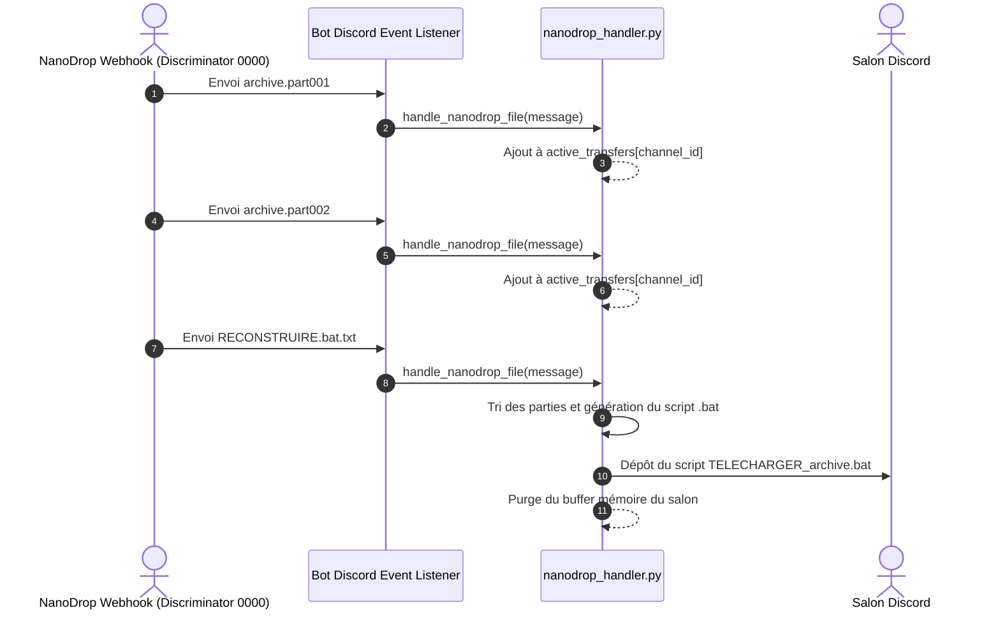
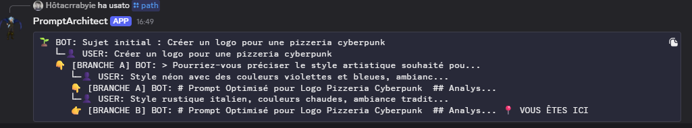

# Bot_Prompt_Engineering

> **Assistant Discord d'ingénierie de prompt exploitant la méthode CO-STAR, modélisant les échanges sous forme d'arbre de décision binaire persistant (SQLite) et visualisable dynamiquement via Graphviz.**

[](https://www.python.org/)
[](https://github.com/Rapptz/discord.py)
[](https://github.com/openai/openai-python)
[](https://graphviz.org/)
[](https://www.sqlite.org/)

---

## Sommaire

- [Vue d'ensemble & Fonctionnalités clés](#vue-densemble--fonctionnalités-clés)
- [Architecture Système & Stack Technique](#architecture-système--stack-technique)
  - [Flux de données global](#flux-de-données-global)
  - [Composants & Dépendances](#composants--dépendances)
  - [Structure de données : Arbre binaire (`DialogueTree`)](#structure-de-données--arbre-binaire-dialoguetree)
  - [Schéma relationnel SQLite](#schéma-relationnel-sqlite)
- [Prérequis & Configuration de l'environnement](#prérequis--configuration-de-lenvironnement)
  - [1. Runtime Python & Binaires système](#1-runtime-python--binaires-système)
  - [2. Prérequis Discord Developer Portal](#2-prérequis-discord-developer-portal)
  - [3. Backend LLM local (LM Studio)](#3-backend-llm-local-lm-studio)
- [Installation & Démarrage](#installation--démarrage)
  - [Variables d'environnement (`.env`)](#variables-denvironnement-env)
  - [Procédure d'installation](#procédure-dinstallation)
  - [Exécution du bot](#exécution-du-bot)
- [Spécification des Commandes Slash](#spécification-des-commandes-slash)
- [Interface Utilisateur Interactive (Discord UI & Modals)](#interface-utilisateur-interactive-discord-ui--modals)
- [Module NanoDrop (Reconstitution d'archives multi-parties)](#module-nanodrop-reconstitution-darchives-multi-parties)
- [Guide Opérationnel & Scénarios d'utilisation](#guide-opérationnel--scénarios-dutilisation)
- [Vérification & Qualité du Code](#vérification--qualité-du-code)
- [Diagnostics & Résolution des Incidents (Troubleshooting)](#diagnostics--résolution-des-incidents-troubleshooting)
- [Arborescence du Répertoire](#arborescence-du-répertoire)
- [Licence & Auteur](#licence--auteur)

---

## Vue d'ensemble & Fonctionnalités clés

**Bot_Prompt_Engineering** est un bot Discord conçu pour structurer, affiner et itérer sur des prompts complexes à destination de modèles de langage (LLMs) ou de générateurs d'images. Contrairement aux approches linéaires, le bot traite la construction d'un prompt comme une arborescence de choix guidée par un cadre méthodologique éprouvé.

### Fonctionnalités Clés

- **Méthodologie CO-STAR intégrée** : Le moteur d'analyse décompose systématiquement les besoins selon six axes stricts :
  - **C**ontext (Contexte global du projet)
  - **O**bjective (Tâche précise à accomplir)
  - **S**tyle (Direction artistique ou d'écriture : Cyberpunk, Académique, etc.)
  - **T**one (Tonalité et ambiance : Neutre, Sombre, Enthousiaste)
  - **A**udience (Public cible destinataire du contenu)
  - **R**esponse/Format (Format technique attendu : Markdown, code, prompt d'image 16:9)
- **Arbre de discussion binaire (`DialogueTree`)** : Chaque itération de réponse de l'utilisateur génère un nœud (`TreeNode`) avec support de deux branches distinctes :
  - **Branche A (Gauche)** : Chemin d'approfondissement principal.
  - **Branche B (Droite)** : Chemin d'expérimentation alternatif.
- **Rendu graphique vectoriel Graphviz** : Exportation dynamique de l'arborescence complète en image PNG haute résolution (300 DPI) stylisée selon les codes graphiques de Discord (fond sombre `#2C2F33`, mise en évidence du nœud courant en rouge pastel, branches colorées).
- **Interface Discord Components v2** : Contrôles interactifs persistants (`TreeControlView`) permettant de remonter dans l'arbre d'un clic (`⬅️ Retour`), de soumettre des réponses via fenêtre modale (`📝 Répondre`), d'exporter le résultat (`💾 Export`) ou d'afficher le plan textuel (`📍 Plan`).
- **Persistance SQLite dénormalisée** : Enregistrement transactionnel de l'historique utilisateur, sérialisation itérative à plat (`flat_v1`) des arbres en base (`data/bot.db`) éliminant tout risque de dépassement de pile de récursion (`sys.getrecursionlimit()`), et gestionnaire de bibliothèque personnelle de prompts avec autocomplétion Discord.
- **Support NanoDrop Webhook** : Détection des flux de fichiers morcelés (`.part*`) émis par des webhooks automatisés (discriminator `0000`) et génération d'un script batch d'assemblage (`TELECHARGER_*.bat`) utilisant `curl`, concaténation binaire (`copy /b`) et décompression PowerShell (`Expand-Archive`).

---

## Architecture Système & Stack Technique

### Flux de données global



### Composants & Dépendances

| Composant | Technologie | Version | Rôle / Responsabilité |
| :--- | :--- | :--- | :--- |
| **Orchestration Discord** | `discord.py` | `2.6.4` | Gestion du Gateway Discord, des commandes applicatives (`app_commands`), des boutons et des modales. |
| **Client d'Inférence IA** | `openai` | `2.8.1` | Client asynchrone (`AsyncOpenAI`) communiquant avec l'API compatible OpenAI de LM Studio. |
| **Gestion de Configuration**| `python-dotenv` | `1.2.1` | Injection des variables d'environnement (`.env`) au démarrage du runtime. |
| **Moteur Graphique** | `graphviz` (Python) | `0.20+` | Génération de graphes dirigés au format DOT et conversion en fichiers PNG haute résolution. |
| **Moteur Graphique Système**| Graphviz CLI (`dot`) | `2.x / 12.x` | Binaire système obligatoire pour le rendu vectoriel (cairo renderer). |
| **Base de Données** | `sqlite3` (Standard Lib) | Standard | Persistance relationnelle ACID locale pour les sessions, l'historique et la bibliothèque. |
| **Backend IA Local** | LM Studio | `0.2.x / 0.3.x` | Serveur d'inférence de modèles de langage (format GGUF) exposant un point de terminaison REST `/v1`. |

---

### Structure de données : Arbre binaire (`DialogueTree`)

Chaque session utilisateur instancie un `DialogueTree` composé de nœuds `TreeNode` interconnectés :

```
          [Racine : Sujet initial (/prompt)]
                          │
                   (User Answer 1)
                          │
                          ▼
                  [Nœud 1 : Style & Format]
                  ┌───────┴───────┐
       (User Answer A)         (User Answer B)
              │                       │
              ▼                       ▼
    [Branche A (Gauche)]    [Branche B (Droite)]
    Direction principale    Variante alternative
              │
       (User Answer 2)
              │
              ▼
   [Nœud Final : Conclusion (is_conclusion=True)]
```

#### Nœud d'arbre (`TreeNode`)
- `question` *(str)* : Texte de la consigne ou question générée par le LLM (ou prompt final si conclusion).
- `cause_answer` *(str)* : Réponse fournie par l'utilisateur ayant mené à ce nœud.
- `left` *(TreeNode)* : Branche A (chemin par défaut).
- `right` *(TreeNode)* : Branche B (variante alternative).
- `parent` *(TreeNode)* : Référence vers le nœud parent pour permettre la navigation ascendante (`/navigate back` ou bouton `Retour`).
- `is_conclusion` *(bool)* : Booléen marquant la complétion de la session et autorisant l'exportation.

#### Sérialisation itérative plate (`flat_v1`)
Pour éviter les limitations de profondeur de récursion de Python (`RecursionError`) lors de la manipulation de grands arbres, `data_structures.py` implémente un algorithme de sérialisation/désérialisation BFS (Breadth-First Search) transformant l'arbre en un dictionnaire indexé par identifiants numériques :

```json
{
  "format": "flat_v1",
  "current_id": 2,
  "nodes": [
    {
      "id": 0,
      "q": "Sujet initial : Affiche de concert",
      "a": null,
      "end": false,
      "l_id": 1,
      "r_id": null
    },
    {
      "id": 1,
      "q": "Quel style visuel souhaitez-vous donner à l'affiche ?",
      "a": "Affiche de concert de rock",
      "end": false,
      "l_id": 2,
      "r_id": 3
    },
    {
      "id": 2,
      "q": "✨ Prompt Final : # Affiche Rock Vintage...",
      "a": "Style rétro vintage des années 70",
      "end": true,
      "l_id": null,
      "r_id": null
    }
  ]
}
```

---

### Schéma relationnel SQLite

La base de données locale `data/bot.db` est régie par trois tables gérées dans [src/database.py](file:///C:/Users/era92/Desktop/Matteo/ecole/Ynov/Programmation/Python/Bot_Prompt_Engineering/src/database.py) :

```sql
-- 1. Historique des commandes utilisateur
CREATE TABLE IF NOT EXISTS command_history (
    id INTEGER PRIMARY KEY AUTOINCREMENT,
    user_id INTEGER,
    command TEXT,
    timestamp DATETIME DEFAULT CURRENT_TIMESTAMP
);

-- 2. Sessions actives d'arbres de dialogue
CREATE TABLE IF NOT EXISTS active_sessions (
    user_id INTEGER PRIMARY KEY,
    tree_data TEXT -- Contient le JSON sérialisé au format flat_v1
);

-- 3. Bibliothèque de prompts sauvegardés
CREATE TABLE IF NOT EXISTS saved_prompts (
    id INTEGER PRIMARY KEY AUTOINCREMENT,
    user_id INTEGER,
    name TEXT,
    content TEXT,
    created_at DATETIME DEFAULT CURRENT_TIMESTAMP,
    UNIQUE(user_id, name) -- Unicité garantie par couple utilisateur/nom
);
```

---

## Prérequis & Configuration de l'environnement

### 1. Runtime Python & Binaires système

- **Python** : Version `3.10` ou supérieure requise (testé et validé sur Python `3.13.2`).
- **Graphviz (binaire système)** : Requis pour la génération de graphiques vectoriels (`/path`).
  - **Windows** :
    ```powershell
    winget install Graphviz.Graphviz
    # ou via Chocolatey :
    choco install graphviz
    ```
    *Vérifiez ensuite que `dot.exe` est présent dans votre variable d'environnement `PATH` en exécutant :*
    ```powershell
    dot -V
    ```
  - **Linux (Ubuntu / Debian)** :
    ```bash
    sudo apt-get update && sudo apt-get install -y graphviz
    ```
  - **macOS (Homebrew)** :
    ```bash
    brew install graphviz
    ```

---

### 2. Prérequis Discord Developer Portal

1. Rendez-vous sur le [Discord Developer Portal](https://discord.com/developers/applications).
2. Créez une nouvelle application et ajoutez un **Bot**.
3. Dans la section **Privileged Gateway Intents**, activez impérativement :
   - **Message Content Intent** *(Requis pour la détection des messages libres dans les salons et l'interception des fichiers NanoDrop)*.
4. Dans **OAuth2 > URL Generator**, sélectionnez les scopes :
   - `bot`
   - `applications.commands`
5. Permissions du bot recommandées :
   - *Send Messages*, *Send Messages in Threads*, *Manage Messages* (pour la commande `/clean`), *Embed Links*, *Attach Files*, *Read Message History*.
6. Copiez le jeton de votre bot (**DISCORD_TOKEN**).

---

### 3. Backend LLM local (LM Studio)

Le bot délègue la génération textuelle à une instance de [LM Studio](https://lmstudio.ai/) ou tout serveur compatible avec l'API OpenAI :
1. Téléchargez et lancez **LM Studio**.
2. Chargez un modèle adapté au prompt engineering (ex: *Llama-3-8B-Instruct*, *Mistral-7B-Instruct*, *Qwen2.5-7B-Instruct*).
3. Démarrez le **Local Server** (onglet développeur / icône double flèche).
4. Le point de terminaison par défaut est généralement : `http://localhost:1234/v1`.

---

## Installation & Démarrage

### Variables d'environnement (`.env`)

Copiez le fichier modèle [.env.template](file:///C:/Users/era92/Desktop/Matteo/ecole/Ynov/Programmation/Python/Bot_Prompt_Engineering/.env.template) vers un fichier `.env` à la racine :

```powershell
Copy-Item .env.template .env
```

| Variable | Portée | Description | Valeur par défaut | Obligatoire |
| :--- | :--- | :--- | :--- | :---: |
| `DISCORD_TOKEN` | Système / Bot | Jeton d'authentification du bot Discord issu du portail développeur. | *Aucune* | **OUI** |
| `LM_STUDIO_URL` | Réseau / IA | URL de l'API locale exposée par LM Studio. | `http://localhost:1234/v1` | NON |

> [!CAUTION]
> Ne commitez jamais votre fichier `.env` ni votre `DISCORD_TOKEN`. Le fichier `.gitignore` est préconfiguré pour exclure tout fichier d'environnement et les bases de données locales.

---

### Procédure d'installation

```powershell
# 1. Cloner le dépôt
git clone https://github.com/MatteoPetronelli/Bot_Prompt_Engineering.git
cd Bot_Prompt_Engineering

# 2. Créer et activer l'environnement virtuel (Windows PowerShell)
python -m venv .venv
.\.venv\Scripts\Activate.ps1

# (Sur Linux/macOS Bash) :
# python3 -m venv .venv
# source .venv/bin/activate

# 3. Mettre à niveau pip et installer les dépendances
pip install --upgrade pip
pip install -r requirements.txt
```

---

### Exécution du bot

> [!IMPORTANT]
> Dans le code source ([src/database.py](file:///C:/Users/era92/Desktop/Matteo/ecole/Ynov/Programmation/Python/Bot_Prompt_Engineering/src/database.py)), le chemin de la base de données est configuré relativement sous la forme `../data/bot.db`. Pour garantir la résolution exacte vers le dossier `data/` du projet, placez-vous dans le répertoire `src` avant de démarrer :

```powershell
# Déplacement dans le répertoire source
cd src

# Lancement du bot
python main.py
```

À l'initialisation, la console affichera :
```text
💾 Base de données SQLite initialisée.
✅ Slash Commands synchronisées : 13 commandes.
✅ Connecté en tant que Bot_Prompt_Engineering#1234
📡 LM Studio : http://localhost:1234/v1
```

Pour arrêter le bot proprement, pressez `Ctrl + C`. Le gestionnaire `finally` garantit la persistance immédiate de toutes les sessions actives en base de données.

---

## Spécification des Commandes Slash

Toutes les commandes utilisent le framework applicatif natif Discord (`/`) et s'enregistrent automatiquement au démarrage (`bot.tree.sync()`) :

| Commande | Paramètres | Permissions requises | Description technique | Type de réponse |
| :--- | :--- | :---: | :--- | :---: |
| `/prompt` | `idee` *(string)* | Utilisateur | Initialise un nouvel arbre `DialogueTree`, enregistre le nœud racine et sollicite le LLM pour la première itération CO-STAR. | Publique + Vue de contrôle |
| `/navigate` | `direction` *(Choice: back, left, right)*, `etapes` *(int=1)* | Utilisateur | Déplace le pointeur `current_node` le long de l'arborescence (vers le parent ou vers l'une des deux branches filles). Sauvegarde l'état en DB. | Publique / Éphémère si bloqué |
| `/path` | *Aucun* | Utilisateur | Génère et envoie la cartographie graphique PNG de l'arbre via Graphviz (300 DPI) avec boutons de contrôle. | Embed + Image jointe + Vue |
| `/export` | *Aucun* | Utilisateur | Génère un fichier texte `.txt` contenant le prompt final si le nœud actif est une conclusion (`is_conclusion=True`). | Fichier joint téléchargeable |
| `/save` | `nom` *(string)* | Utilisateur | Sauvegarde le contenu du prompt actif dans la table `saved_prompts` de l'utilisateur sous un nom unique. | Éphémère |
| `/load` | `nom` *(autocomplete)* | Utilisateur | Charge un prompt depuis la bibliothèque personnelle. Envoie un fichier `.md` si le texte excède 1900 caractères. | Publique / Fichier si volumineux |
| `/library` | *Aucun* | Utilisateur | Liste l'ensemble des prompts enregistrés par l'utilisateur connecté. | Éphémère |
| `/delete_prompt` | `nom` *(autocomplete)* | Utilisateur | Supprime définitivement un prompt de la bibliothèque SQLite de l'utilisateur. | Éphémère |
| `/speak` | `sujet` *(string)* | Utilisateur | Parcourt itérativement l'arbre actif (pile DFS) pour vérifier si un mot-clé a été mentionné dans les questions ou réponses. | Publique |
| `/history` | *Aucun* | Utilisateur | Affiche les 20 dernières commandes exécutées par l'utilisateur (ordre chronologique inversé). | Éphémère |
| `/last` | *Aucun* | Utilisateur | Récupère et affiche la commande immédiatement antérieure à l'appel `/last`. | Publique |
| `/clear_history` | *Aucun* | Utilisateur | Purge l'intégralité de l'historique de commandes de l'utilisateur dans `command_history`. | Éphémère |
| `/clean` | `nombre` *(int=100)* | `Gérer les messages` | Purge les N derniers messages du salon Discord et réinitialise les tampons d'échange NanoDrop en mémoire. | Éphémère |
| `/reset` | *Aucun* | Utilisateur | Remise à zéro totale : détruit la session en RAM, purge la table `active_sessions` et vide l'historique utilisateur. | Éphémère |
| `/status` | *Aucun* | Utilisateur | Sonde l'API LM Studio (`client.models.list()`) et dénombre les sessions en cours d'exécution. | Publique |

---

## Interface Utilisateur Interactive (Discord UI & Modals)

Le bot intègre une vue interactive persistante (`TreeControlView` dans [src/ui.py](file:///C:/Users/era92/Desktop/Matteo/ecole/Ynov/Programmation/Python/Bot_Prompt_Engineering/src/ui.py)) rattachée aux messages de dialogue et de cartographie :

```
[ ⬅️ Retour ]  [ 📝 Répondre ]  [ 💾 Export ]  [ 📍 Plan ]
```

1. **Bouton `⬅️ Retour` (Gris)** :
   - Remonte immédiatement vers le `parent` du nœud actif.
   - Synchronise l'état en base SQLite (`save_session`).
   - Bloque avec message éphémère si l'utilisateur est déjà à la racine.
2. **Bouton `📝 Répondre` (Bleu)** :
   - Déclenche l'ouverture d'un formulaire modal natif Discord (`ResponseModal`).
   - Champ de saisie multiligne acceptant jusqu'à 1000 caractères.
   - À la soumission, réactive la discussion et transmet la réponse à `generate_next_step`.
3. **Bouton `💾 Export` (Vert)** :
   - Vérifie si le nœud actif est marqué `is_conclusion`.
   - Produit à la volée un fichier `prompt_<nom_utilisateur>.txt` nettoyé par `sanitize_filename`.
   - Envoie le fichier en message éphémère puis supprime le fichier temporaire du disque.
4. **Bouton `📍 Plan` (Gris)** :
   - Génère la représentation textuelle indentée de l'arborescence (`tree.get_visualization()`).
   - Si la taille dépasse 1900 caractères, transmet un fichier `tree_view.txt` joint.

---

## Module NanoDrop (Reconstitution d'archives multi-parties)

Le module [src/nanodrop_handler.py](file:///C:/Users/era92/Desktop/Matteo/ecole/Ynov/Programmation/Python/Bot_Prompt_Engineering/src/nanodrop_handler.py) fournit un pipeline automatisé de contournement des limites de téléversement Discord :



### Caractéristiques du script batch généré (`TELECHARGER_*.bat`) :
- Encodage en page de code `cp850` (support natif console Windows).
- Téléchargement séquentiel via `curl -L` des URLs Discord CDN associées à chaque segment.
- Assemblage binaire sans altération d'intégrité via `copy /b chunk1 + chunk2 archive.compressed.zip`.
- Décompression forcée via `PowerShell -command "Expand-Archive -Force"`.
- Nettoyage du répertoire temporaire et auto-suppression du script d'exécution (`del "%~f0"`).

---

## Guide Opérationnel & Scénarios d'utilisation

### Scénario 1 : Création d'un prompt d'image avec embranchement

1. Lancez la commande d'amorce dans un salon :
   ```
   /prompt idee:Une affiche de festival de musique électronique
   ```
2. Le bot initialise la session et interroge LM Studio, qui renvoie une première question de cadrage CO-STAR :
   > 🤖 **Question :** Quel style visuel et quelle palette de couleurs souhaitez-vous adopter ?
3. Répondez soit directement par message texte dans le salon, soit en cliquant sur `📝 Répondre` :
   ```
   Ambiance Cyberpunk néon avec dominante de violet et bleu nuit, format 16:9
   ```
4. Le bot positionne cette réponse sur la **Branche A** et pose une nouvelle question sur la cible ou la composition.
5. Si vous souhaitez explorer une autre idée :
   - Reculez d'un cran : `/navigate direction:back` (ou clic sur `⬅️ Retour`).
   - Répondez une alternative :
     ```
     Style Art Déco rétro-futuriste avec dorures
     ```
   - Le bot crée automatiquement la **Branche B** (`🔀 Nouvelle branche créée à Droite`).
6. Tapez `/path` à tout moment pour visualiser la bifurcation :



---

### Scénario 2 : Finalisation et sauvegarde en bibliothèque

1. Une fois les critères CO-STAR réunis, l'IA produit une conclusion :
   > ✨ **Prompt Final** (Affiché dans un embed vert structuré en Markdown)
2. Exportez le prompt sous forme de fichier :
   ```
   /export
   ```
3. Enregistrez-le dans votre bibliothèque SQLite pour réutilisation ultérieure :
   ```
   /save nom:festival_cyberpunk_v1
   ```
4. Consultez votre bibliothèque :
   ```
   /library
   ```
5. Rechargez le prompt à tout instant :
   ```
   /load nom:festival_cyberpunk_v1
   ```

---

## Vérification & Qualité du Code

Pour auditer la validité syntaxique des fichiers Python du projet :

```powershell
# Vérification de compilation sans exécution
python -m py_compile src/ai_logic.py src/bot_routes.py src/config.py src/database.py src/data_structures.py src/main.py src/nanodrop_handler.py src/ui.py src/utils.py

# Test d'initialisation du schéma SQLite
python -c "import sys; sys.path.insert(0, 'src'); from database import init_db; init_db()"

# Vérification de la disponibilité du moteur Graphviz
dot -V
```

---

## Diagnostics & Résolution des Incidents (Troubleshooting)

### 1. `ValueError: ERREUR : Token Discord manquant.`
- **Cause** : Le fichier `.env` est absent à la racine du projet ou la variable `DISCORD_TOKEN` est vide.
- **Remède** : Copiez `.env.template` vers `.env` et renseignez le jeton de votre bot Discord.

### 2. `🔴 LM Studio injoignable` / `APIConnectionError`
- **Cause** : LM Studio n'est pas lancé, le serveur local est arrêté, ou l'adresse configurée dans `LM_STUDIO_URL` est incorrecte.
- **Remède** : Ouvrez LM Studio, chargez un modèle, cliquez sur **Start Server** sur le port `1234`, et vérifiez que l'URL dans `.env` correspond à `http://localhost:1234/v1`.

### 3. `❌ Erreur Graphviz` / `ExecutableNotFound: failed to execute 'dot'`
- **Cause** : Le binaire Graphviz n'est pas installé sur le système d'exploitation ou n'est pas présent dans la variable d'environnement `PATH`.
- **Remède** : Installez Graphviz (`winget install Graphviz.Graphviz` sous Windows), redémarrez votre terminal, et vérifiez avec `dot -V`. Le bot bascule automatiquement sur un affichage textuel de secours en cas d'absence.

### 4. `sqlite3.OperationalError: unable to open database file`
- **Cause** : Le bot a été exécuté depuis la racine sans que le dossier `data/` relatif ne soit correctement ciblé.
- **Remède** : Placez-vous impérativement dans le répertoire `src` avant de lancer le bot (`cd src; python main.py`).

### 5. Les commandes Slash (`/`) n'apparaissent pas dans Discord
- **Cause** : Le bot n'a pas été invité avec le scope `applications.commands`, ou les commandes n'ont pas encore été synchronisées sur le serveur.
- **Remède** : Réinvitez le bot avec l'URL OAuth2 adéquate incluant le scope `applications.commands`. Au démarrage, le bot exécute `await bot.tree.sync()`. En cas de discordance globale, la propagation peut nécessiter quelques minutes selon les caches Discord.

### 6. Le bot ne réagit pas aux messages textuels ordinaires
- **Cause** : L'intention privilégiée **Message Content Intent** n'est pas activée dans le portail développeur Discord.
- **Remède** : Rendez-vous sur le [Discord Developer Portal](https://discord.com/developers/applications), sélectionnez votre application > **Bot** > **Privileged Gateway Intents**, cochez **Message Content Intent** et sauvegardez.

---

## Arborescence du Répertoire

```text
Bot_Prompt_Engineering/
├── .env.template               # Gabarit des variables d'environnement
├── .gitignore                  # Règles d'exclusion Git (sécurité & données locales)
├── ideas.txt                   # Notes de conception et pistes d'évolutions
├── README.md                   # Documentation technique de référence
├── requirements.txt            # Manifeste des dépendances Python requises
├── data/
│   ├── .keep                   # Maintien du répertoire sous contrôle de version
│   └── bot.db                  # Base de données SQLite (sessions, historique, prompts)
├── doc/
│   ├── doc.md                  # Documentation historique des fonctionnalités
│   └── img/                    # Captures d'écran et illustrations de l'interface
│       ├── binary_path.png     # Cartographie Graphviz avec embranchement A/B
│       ├── export.png          # Capture de la commande /export
│       ├── navigate_back.png   # Navigation ascendante
│       ├── navigate_left.png   # Navigation sur la branche gauche
│       ├── navigate_right.png  # Navigation sur la branche droite
│       ├── prompt.png          # Initialisation de la commande /prompt
│       ├── reset.png           # Remise à zéro
│       └── status.png          # État de la connectivité LM Studio
└── src/
    ├── __init__.py             # Initialisateur de module Python
    ├── ai_logic.py             # Moteur d'analyse CO-STAR et requêtage LM Studio
    ├── bot_routes.py           # Définition des routes, commandes slash et événements
    ├── config.py               # Instanciation Discord, client AsyncOpenAI et config
    ├── data_structures.py      # Structures DialogueTree, TreeNode et export Graphviz
    ├── database.py             # Couche d'accès et persistance SQLite 3
    ├── main.py                 # Point d'entrée de l'application et arrêt gracieux
    ├── nanodrop_handler.py     # Gestionnaire de réassemblage de flux multi-parties
    ├── ui.py                   # Composants d'interface (TreeControlView, ResponseModal)
    └── utils.py                # Utilitaires de désinfection de chaînes et noms de fichiers
```

---

## Licence & Auteur

- **Auteur** : Projet développé par Matteo Petronelli dans le cadre du cursus d'ingénierie informatique (Ynov Informatique).
- **Licence** : Tous droits réservés / Propriétaire. Usage pédagogique et personnel autorisé.
