# Documentation des fonctionnalités

**Résumé rapide**
- Le code principal du bot se trouve dans `src/`.
- Les données persistantes sont stockées localement dans `data/bot_data.json` (non suivies par Git).
- Les secrets et l'URL de LM Studio sont fournis via un fichier `.env` (non commité). L'URL LM Studio peut changer après un redémarrage du serveur.

---

**1) /prompt <idee>**
- Usage: `/prompt idee:"Une idée de base"`
- Ce que fait la commande:
  - Initialise une nouvelle session d'"Architecte de Prompt" pour l'utilisateur.
  - Crée un nouvel arbre de discussion (`DialogueTree`) dont la racine contient l'`idee` fournie.
  - Enregistre l'appel dans l'historique utilisateur.
  - Lance la fonction IA locale (`generate_next_step`) qui interroge LM Studio pour générer la prochaine question ou la conclusion finale.
- Résultat attendu: message de confirmation puis une question ou un prompt final (embed) envoyé par le bot.
- Exemple visuel:
  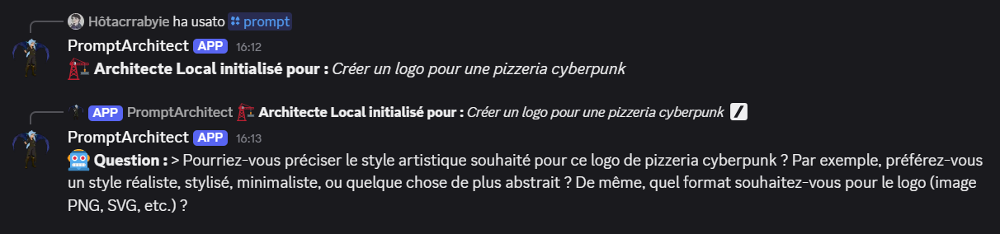

**Notes**: Si l'IA renvoie un objet JSON dont le champ `type` vaut `question`, le bot posera une question à l'utilisateur. Si `type` vaut `conclusion`, le bot publie le prompt final et invite à utiliser `/export`.

---

**2) /reset**
- Usage: `/reset`
- Ce que fait la commande:
  - Supprime la session active de l'utilisateur (l'arbre de discussion) si elle existe.
  - Supprime toutes les entrées d'historique de cet utilisateur dans `CommandHistory`.
  - Répond de manière éphémère avec le résumé des actions (session effacée / historique vidé).
- Exemple visuel:
  - 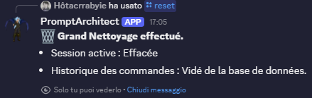

---

**3) /speak <sujet>**
- Usage: `/speak sujet:"motclef"`
- Ce que fait la commande:
  - Recherche dans l'arbre de l'utilisateur actif si le `sujet` a été mentionné (méthode `search_topic`).
  - Répond oui/non selon le résultat.
- Précondition: une session active doit exister.
- Exemple visuel:
  - 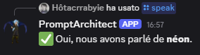

---

**4) /history**
- Usage: `/history`
- Ce que fait la commande:
  - Ajoute l'appel à l'historique.
  - Récupère et affiche l'historique des commandes de l'utilisateur (liste limitée si trop longue). La réponse est éphemère.
- Exemple visuel:
  - 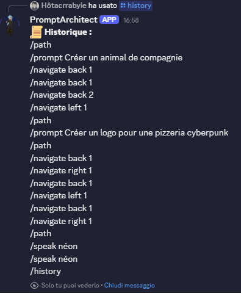

---

**5) /last**
- Usage: `/last`
- Ce que fait la commande:
  - Affiche la dernière commande de l'utilisateur provenant de `CommandHistory`.
- Exemple visuel:
  - 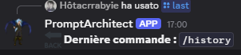

---

**6) /clear_history**
- Usage: `/clear_history`
- Ce que fait la commande:
  - Vide complètement l'historique global (`global_history.clear()`), supprimant toutes les entrées.
  - Réponse éphémère confirmant l'action.
- Exemple visuel:
  - 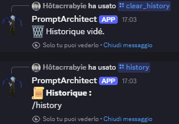

---

**7) /export**
- Usage: `/export`
- Ce que fait la commande:
  - Vérifie qu'une session active existe et que le noeud courant est une conclusion (`is_conclusion == True`).
  - Crée un fichier texte contenant le prompt final, envoie le fichier en pièce jointe, puis supprime le fichier temporaire.
  - Ajoute l'appel à l'historique.
- Restrictions: Ne fonctionne que si la session est terminée (conclusion). Sinon renvoie un message d'erreur éphémère.
- Exemple visuel:
  - 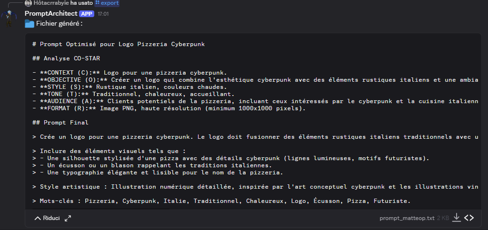

---

**8) /path**
- Usage: `/path`
- Ce que fait la commande:
  - Parcourt l'arbre de la session active et génère une représentation textuelle des noeuds et des branches (incluant l'indication du noeud courant).
  - Si la chaîne dépasse la limite de message Discord, le bot crée un fichier `tree_view.txt` et l'envoie en pièce jointe.
  - Ajoute l'appel à l'historique.
- Exemple visuel:
  - 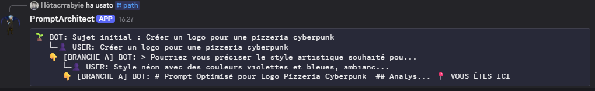

---

**9) /navigate <direction> [etapes]**
- Usage: `/navigate direction:back|left|right etapes:1`
- Choix de `direction`: `back` (remonter vers la racine), `left` (descendre branche A), `right` (descendre branche B). `etapes` nombre d'étapes.
- Ce que fait la commande:
  - Déplace le `current_node` de l'arbre de la session selon la direction et le nombre d'étapes fournis.
  - Si le déplacement mène sur une conclusion, l'aperçu de la conclusion est affiché.
  - Sinon, affiche la question du noeud cible et les réponses gauche/droite si existantes;
    sinon invite à taper un message libre pour créer une branche.
  - Ajoute l'appel à l'historique.
- Exemples visuel:
  - Navigate back
    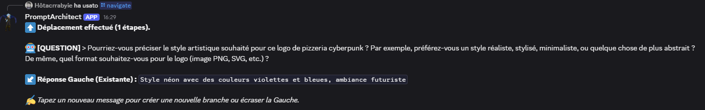
  - Navigate left
    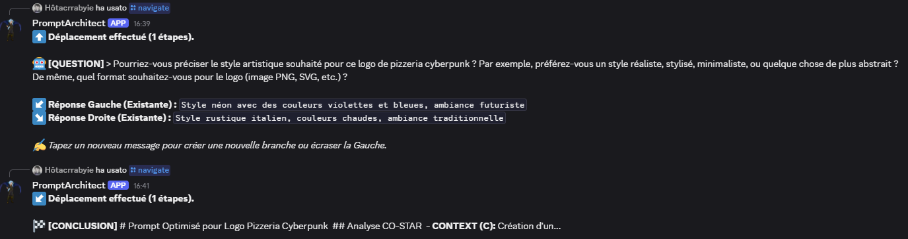
  - Navigate right
    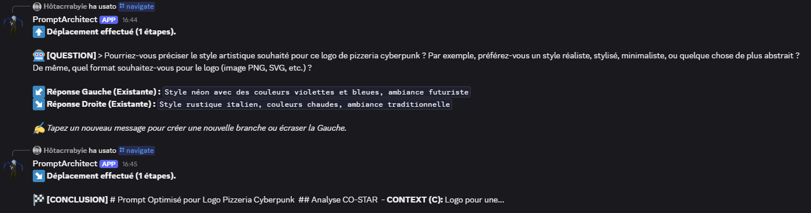
  - Path de l'arbre binaire
    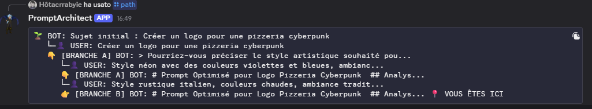
    

---

**10) /status**
- Usage: `/status`
- Ce que fait la commande:
  - Vérifie la connectivité basique à LM Studio (tentative d'appel `client.models.list()`), retourne `Connecté` ou `Injoignable`.
  - Indique le nombre de sessions actives.
- Exemple visuel:
  - 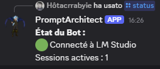

---

**Comportement pour les messages libres (texte simple)**
- Lorsque l'utilisateur a une session active (présente dans `active_trees`) et que le noeud courant existe, le bot écoute les messages texte ordinaires (non commençant par `/` ou `!`).
  - Ces messages sont envoyés à la fonction `generate_next_step`, qui interagit avec LM Studio pour produire soit une nouvelle question (branche) soit une conclusion.
  - Si le noeud courant est une conclusion et que l'utilisateur envoie un message, le flag `is_conclusion` est réinitialisé à `False` et la discussion reprend.

**Exemple visuel (interaction par messages)**:
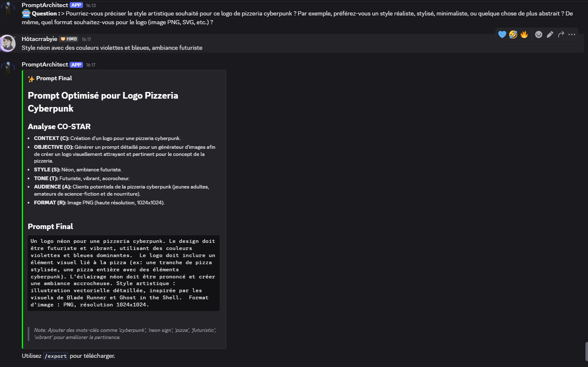

---

**Fonctionnalités techniques annexes**
- Sauvegarde automatique: `save_game_data` est appelée lors de `on_disconnect` et à la fermeture du programme. Elle écrit `data/bot_data.json`.
- Chargement: `load_game_data` restaure l'historique et les sessions au démarrage (`on_ready`).
- Nettoyage de nom de fichier: `sanitize_filename` est utilisé avant de générer des fichiers exportés.

---

**Notes et limites importantes**
- Le bot s'appuie sur une API locale LM Studio (via `AsyncOpenAI` configuré avec `base_url=LM_STUDIO_URL`). Assurez-vous que l'URL dans `.env` pointe vers l'instance correcte.
- LM Studio peut assigner une URL différente au redémarrage : mettez à jour `LM_STUDIO_URL` dans `.env` si nécessaire.
- Le `DISCORD_TOKEN` et l'URL de LM Studio ne doivent jamais être committés dans le dépôt. Le fichier `.gitignore` exclut `.env` et `data/*.json`.

---
